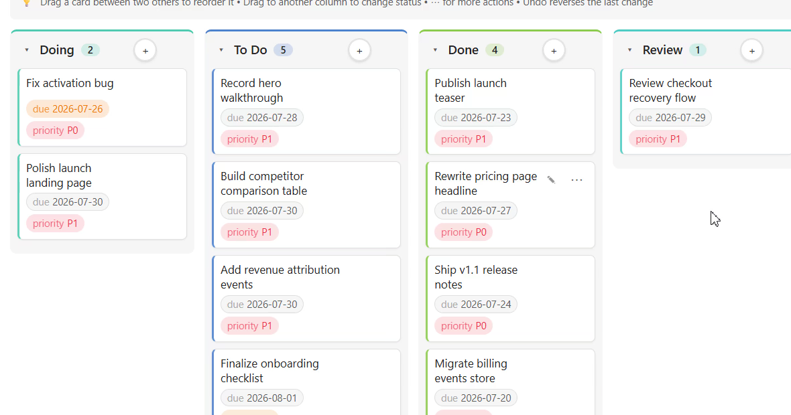

# Bases Power Pack

Turn Obsidian **Bases** into a real planning workspace: a genuinely useful free Kanban board, plus premium Calendar, Gantt, Dashboard, Gallery, Pivot, Feed, formulas, roll-ups, saved filters, and automation.

> **Start free. Upgrade once.** Bases Power Pack has a free Lite tier, and Premium unlocks with a **~$29 one-time** license.

## See it in action


_Move a card across columns and reorder it in one gesture._


_Push work cleanly from review to done without leaving the board._



_Kanban cards can show due dates, priority, owners, and more — without turning into YAML sludge._


_One drag can move the work and leave the board in a cleaner state._

## Why people buy it

- **The free tier is actually useful.** You get a real Kanban board, not a crippled teaser.
- **It writes back to your notes.** Drag a card, reschedule a date, resize a timeline bar — the frontmatter updates.
- **It reduces note janitor work.** Inline edits, bulk edit, search, saved filters, and automation keep you in the workflow instead of babysitting YAML.
- **Premium adds planning depth, not filler.** Calendar, Gantt, Dashboard, Gallery, Pivot, Feed, formulas, roll-ups, and `.base` workflows are the upgrade story.
- **It stays local-friendly.** No account and no mandatory cloud dependency just to unlock what you bought.

## What you get

| Capability | Lite (free) | Premium |
| --- | :---: | :---: |
| Real Kanban board for Bases / frontmatter notes | ✅ | ✅ |
| Drag cards across columns and reorder them manually | ✅ | ✅ |
| Quick add, inline edit, bulk edit, search, export to Markdown | ✅ | ✅ |
| Swimlanes, WIP limits, multi-select moves, touch + keyboard moves | ✅ | ✅ |
| Calendar + Gantt planning views | — | ✅ |
| Dashboard + Pivot + Gallery + Feed views | — | ✅ |
| Formulas, roll-ups, saved filters, `.base`-driven workflows | — | ✅ |
| Move Rules automation, CSV export, color rules | — | ✅ |

## Views at a glance

- **Kanban** — group work by a property like `status`, drag cards, reorder them, and edit metadata in place.
- **Calendar** — see work by day/week/month and drag events to reschedule them.
- **Gantt** — plan spans and milestones on a timeline; drag bars to move or resize them.
- **Outline** — turn parent/child notes into a real hierarchy with progress roll-ups.
- **Pivot** — cross-tabulate rows × columns like a lightweight spreadsheet.
- **Dashboard** — KPI cards and distribution charts over your current dataset.
- **Gallery** — visual card grid with cover images and metadata pills.
- **Feed** — reverse-chronological stream grouped by day, week, or month.

## 2-minute quick start

1. Run **Open Kanban view (Lite)** from the command palette or click the ribbon icon.
2. Add a property like `status: To Do` to a few notes.
3. Drag a card to another column and watch the note update.
4. Click **⋯** on a card to edit, rename, move, or delete.
5. Use **search** to narrow the board and **Export** to copy it out.
6. If you want planning views and database-style workflows, unlock Premium.

## Premium activation

Premium is a **one-time unlock**, not a subscription.

1. Buy a license.
2. Paste the key into **Settings → Bases Power Pack → License**.
3. Premium views and features unlock immediately.

Your key is verified **offline**. No account, no always-on server, no mandatory cloud dependency.

Premium includes:
- Calendar, Gantt, Outline, Pivot, Dashboard, Gallery, and Feed views
- formulas, roll-ups, saved filters, and `.base`-driven workflows
- Move Rules automation, CSV export, and rule-based color coding

## Commands

Available from the command palette:

- **Open Kanban view (Lite)**
- **Open Calendar view (Premium)**
- **Open Gantt view (Premium)**
- **Open Outline view (Premium)**
- **Open Pivot view (Premium)**
- **Open Dashboard view (Premium)**
- **Open Gallery view (Premium)**
- **Open Feed view (Premium)**
- **Undo last change**
- **Verify license key**

Premium view commands are always visible. If you have not unlocked Premium yet, they open an in-view unlock screen instead of disappearing like cowards.

## Install into a vault for testing

Copy these three files into:

```text
<your-vault>/.obsidian/plugins/bases-power-pack/
```

Files:

```text
main.js
manifest.json
styles.css
```

Then enable **Bases Power Pack** in **Settings → Community plugins**.

## Build

```bash
npm install
npm run build
npm run dev
npm run typecheck
npm test
```

`npm run build` produces `main.js` in the project root alongside `manifest.json` and `styles.css`.

## License

MIT for the source code. Premium feature access is governed by a signed license key.
